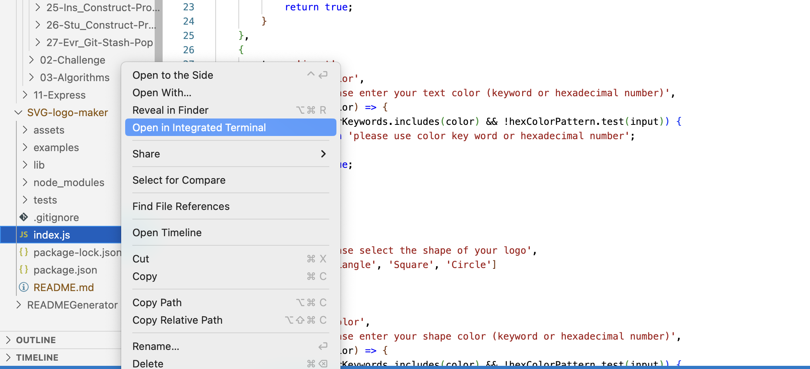
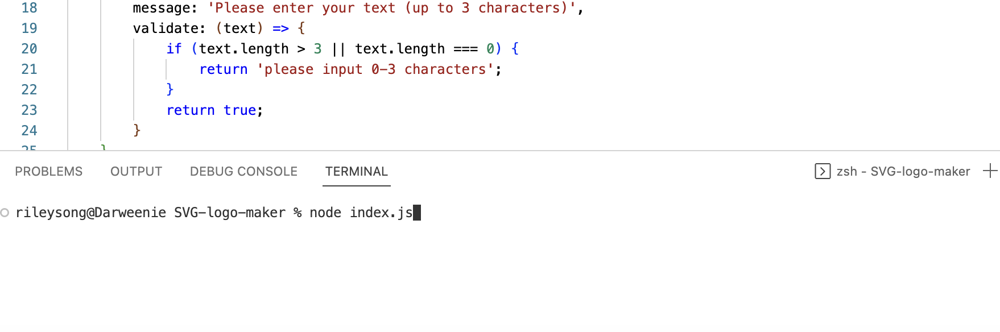

# SVG Logo Maker
  
  ## Description
  This project was built to demonstrate my knowledge of Node.js, Inquirer, and Object Oriented Programming. The application takes userinput prompted by Inquirer and generates an SVG logo.

  ## Table of Contents
  [Description](#description)

  [Installation](#installation)

  [Usage](#usage)

  [Credits](#credits)

  [Testing](#testing)

  [License](#license)

  [Questions](#questions)

  ## Installation 
  Node.js
  ## Usage
  To use this README Generator, users must have Node.js and open the directory in the integrated terminal. Users can then type node index.js in the terminal to initialize the app. Type each input and hit enter to move to the next prompt. To open the terminal:
  

  To initialize the app:
  
  
  ## Credits
  N/A 
  ## Testing
  Use the 'tests' folder for testing.

  ## License
  A short and simple permissive license with conditions only requiring preservation of copyright and license notices. Licensed works, modifications, and larger works may be distributed under different terms and without source code.
  [https://opensource.org/license/mit/](https://opensource.org/license/mit/)
  ## Questions
  Please reach out to rileysong01, at [https://github.com/rileysong01](https://github.com/rileysong01) or at rsong47@uwo.ca for additional questions. 
